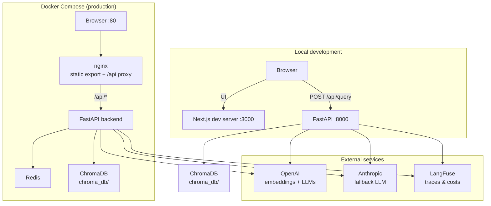
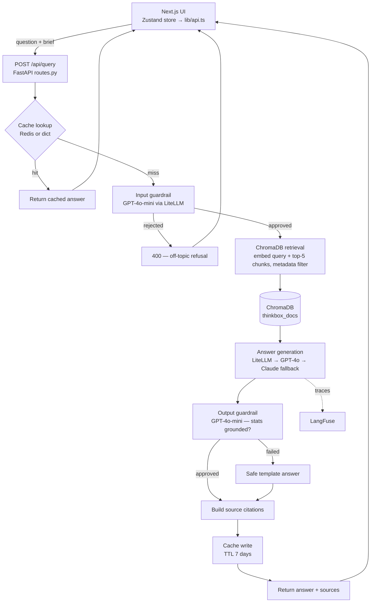
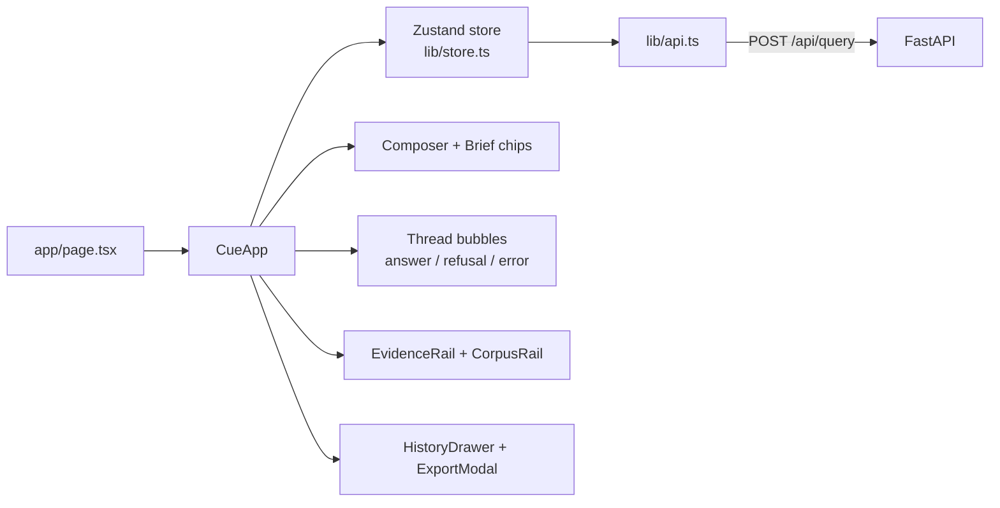
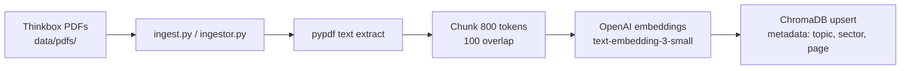

# Cue — TV Investment Advisor

A RAG-powered web application that helps brands and agencies understand when and how TV advertising could work for them, grounded in Thinkbox's published research. Think of it as a senior media planner available 24/7.

Built as a portfolio project targeting AI backend engineer roles — demonstrating RAG pipelines, LiteLLM gateway, ChromaDB, LangFuse observability, guardrails, Redis caching, and a React frontend.

---

## Architecture

Cue is a RAG application: a Next.js chat UI calls a FastAPI backend that retrieves Thinkbox research from ChromaDB, generates grounded answers via LiteLLM, and caches responses in Redis (or an in-memory dict when `REDIS_URL` is unset).

### Deployment

**Local dev** — Next.js serves the UI on `:3000`; the browser calls FastAPI on `:8000` via `NEXT_PUBLIC_API_URL`. **Docker** — nginx serves the static export and proxies `/api/*` to the backend; Redis backs the cache.



### Query pipeline

Structured brief fields (`sector`, `brand_stage`, etc.) shape cache keys and ChromaDB metadata filters alongside the freeform question.



### Frontend structure



### Offline ingestion

Run manually via `scripts/ingest.py` or `POST /api/ingest` (API key required).



## Tech Stack

| Layer | Technology |
|-------|-----------|
| Frontend | Next.js 16, React 19, TypeScript, Tailwind CSS v4, Zustand v5 |
| Backend | FastAPI, Python 3.13, Pydantic v2 |
| LLM gateway | LiteLLM (OpenAI primary, Anthropic fallback) |
| Vector store | ChromaDB (local persistent) |
| Observability | LangFuse (traces, costs, guardrail outcomes) |
| Cache | Redis (production) / in-memory dict (development) |
| Containerisation | Docker Compose (dev) / single-container Dockerfile (standalone) |
| E2E tests | Playwright (mock mode, no API keys required) |

---

## Quick Start

### Local development

**Backend:**
```bash
cd backend
cp .env.example .env   # fill in API keys
uv run uvicorn app.main:app --reload --port 8000
```

**Frontend:**
```bash
cd frontend
npm install
npm run dev            # http://localhost:3000
```

### Docker (full stack — nginx + Redis)

```bash
cp backend/.env.example backend/.env   # fill in API keys
cp .env.example .env                   # set UID/GID so ChromaDB bind mount is writable
docker-compose up --build
```

The root `.env` sets `UID` and `GID` to match your host user (required on Linux/WSL so `./backend/chroma_db` is not read-only inside the container). Run `id -u` and `id -g` if unsure.

The backend runs at `http://localhost:8000`. Set `NEXT_PUBLIC_API_URL=http://localhost:8000` in `frontend/.env.local` so the browser can reach the API (see `frontend/README.md`).

### Standalone single-container (no nginx or Redis dependency)

```bash
cp backend/.env.example backend/.env
docker-compose -f docker-compose.standalone.yml up --build
```

The root `Dockerfile` is a multi-stage build: Node 22 builds the Next.js static export, then Python 3.13 runs FastAPI and serves the static files via `STATIC_DIR`. All traffic on `:8000`.

### Ingest the corpus

Download the [Thinkbox research PDFs](https://www.thinkbox.tv/research) into `data/pdfs/`, then:

```bash
cd backend
uv run scripts/ingest.py
```

---

## Environment Variables

Create `backend/.env` from `backend/.env.example`:

```bash
# LLM providers
OPENAI_API_KEY=sk-...
ANTHROPIC_API_KEY=sk-ant-...

# LangFuse observability (free at cloud.langfuse.com)
LANGFUSE_PUBLIC_KEY=pk-lf-...
LANGFUSE_SECRET_KEY=sk-lf-...
LANGFUSE_HOST=https://cloud.langfuse.com

# API key for POST /api/ingest
API_KEY=change-me-in-production

# CORS (comma-separated)
CORS_ORIGINS=http://localhost:3000

# Redis — leave empty to use in-memory dict cache for local dev
# REDIS_URL=redis://localhost:6379/0

# Mock mode — returns deterministic answers without calling any LLM/embeddings API
# Useful for offline development and E2E tests
# LLM_MOCK=false
```

---

## API Reference

### `POST /api/query`

```json
{
  "question": "When does TV work best for FMCG brands?",
  "sector": "FMCG",
  "brand_stage": "scale-up",
  "tv_history": "never",
  "primary_goal": "brand",
  "budget_tier": "100k-500k"
}
```

All fields except `question` are optional. Valid enum values:

| Field | Values |
|-------|--------|
| `sector` | `FMCG` `Retail` `Finance` `Auto` `Telco` `Travel` `DTC` `Other` |
| `brand_stage` | `start-up` `scale-up` `established` `large` |
| `tv_history` | `never` `tried` `regular` |
| `primary_goal` | `sales` `brand` `both` `unsure` |
| `budget_tier` | `under-100k` `100k-500k` `500k-2m` `2m-plus` `undecided` |

Response:
```json
{
  "answer": {
    "summary": ["Based on Thinkbox research, TV delivers £5.61 ROI per £1 spent [1]."],
    "stats": [{ "value": "£5.61", "unit": "ROI per £1 spent", "context": "141 brands, 14 categories", "source": "Profit Ability 2", "page": 12 }],
    "chart": null,
    "checklist": null,
    "followups": ["How does this change for a DTC brand?"]
  },
  "sources": [
    { "title": "Profit Ability 2", "chunk": "TV delivered...", "url": "https://thinkbox.tv/..." }
  ],
  "cached": false,
  "model_used": "gpt-4o"
}
```

### `GET /api/health`

```json
{ "status": "ok", "chroma_docs": 142, "version": "0.1.0", "redis": "ok" }
```

`redis`: `"ok"` | `"disabled"` | `"unavailable"`

### `POST /api/ingest`

Requires `X-API-Key` header. Ingests a single document.

```json
{ "source_path": "data/pdfs/profit-ability-2.pdf" }
```

---

## Project Structure

```
tv-invest-advisor/
├── backend/
│   ├── app/
│   │   ├── main.py               # FastAPI app, lifespan startup, CORS, static file mount
│   │   ├── models.py             # Shared Pydantic models (StructuredAnswer, AnswerStat, etc.)
│   │   ├── api/routes.py         # /api/query, /api/ingest, /api/health
│   │   ├── core/config.py        # Settings via pydantic-settings (incl. LLM_MOCK)
│   │   └── services/
│   │       ├── embedder.py       # OpenAI text-embedding-3-small
│   │       ├── retriever.py      # ChromaDB retrieval + metadata filter
│   │       ├── generator.py      # LiteLLM → GPT-4o / Claude fallback; strict JSON validation
│   │       ├── cache.py          # Redis + in-memory dict, same interface
│   │       ├── guardrails.py     # Input + output LLM checks
│   │       └── ingestor.py       # PDF → chunks → embeddings → ChromaDB
│   ├── scripts/
│   │   ├── ingest.py             # Offline corpus ingestion
│   │   └── test_retrieval.py     # Retrieval quality smoke test
│   ├── tests/                    # pytest unit + integration tests
│   ├── Dockerfile                # Backend-only image (used by docker-compose.yml)
│   └── pyproject.toml
├── frontend/
│   ├── app/                      # Next.js App Router
│   ├── components/               # atoms / composer / thread / rail / layout
│   ├── overlays/                 # HistoryDrawer, ExportModal
│   ├── lib/                      # types.ts, api.ts, store.ts (Zustand)
│   └── __tests__/                # Jest + React Testing Library (62 tests)
├── e2e/                          # Playwright E2E tests (LLM_MOCK=true, no API keys needed)
│   ├── tests/app.spec.ts
│   └── playwright.config.ts
├── data/pdfs/                    # Thinkbox PDFs (gitignored — add manually)
├── Dockerfile                    # Multi-stage: Node 22 → Python 3.13 (standalone)
├── docker-compose.yml            # Full stack: nginx + Redis + backend
├── docker-compose.standalone.yml # Single-container: FastAPI serves static + API
└── README.md
```

---

## Key Design Decisions

**LiteLLM gateway** — wraps OpenAI and Anthropic behind a single interface. Model routing, fallback chains, and cost tracking work without touching call sites. Kept even where it feels like overkill because it's a named requirement for the target role.

**ChromaDB local** — zero cost, no external dependency, runs in Docker. Sufficient for an 8-10 document corpus. Swap path: same `retriever.py` interface → Qdrant or pgvector.

**Two-stage guardrails** — GPT-4o-mini checks input (on-topic?) and output (stats grounded in sources?). Hallucinated statistics in a media planning tool cause real commercial harm, so both stages are non-negotiable.

**Redis / dict cache** — `cache.py` exposes a `get`/`set`/`clear` interface. `REDIS_URL` set → `RedisCache`; unset → `ResponseCache` (dict). Redis errors degrade gracefully to cache-miss, never 500. `fakeredis` in tests — no real Redis needed in CI.

**Static export + nginx reverse proxy** — `frontend/` builds to static files (`output: 'export'`). In production (`docker compose up`), nginx serves the static export on `:80` and proxies `/api/*` to FastAPI. In local development, run Next.js dev server (`npm run dev`) on `:3000` and FastAPI on `:8000` separately. No Node.js runtime in production.

**Strict LLM output validation** — `generator.py` validates every LLM response against `StructuredAnswer` (Pydantic v2). Invalid JSON or schema mismatches raise immediately; `routes.py` catches these as 503s. No silent fallbacks that could mask hallucinations.

**LLM mock mode** — Set `LLM_MOCK=true` to short-circuit all LLM and embedding calls. Generator, guardrails, and retriever return deterministic fixtures. Used for offline development and Playwright E2E tests — no API keys or live services needed.

---

## Development

```bash
# Backend — lint and test
cd backend
uv run black .
uv run flake8 .
uv run pytest

# Frontend — lint and test
cd frontend
npm run lint
npm test

# E2E tests (Playwright — starts backend + frontend automatically)
cd e2e
npm install
npx playwright install chromium
npm test
```

E2E tests use `LLM_MOCK=true` so no API keys are required. Playwright spins up both servers automatically via `webServer` config.
